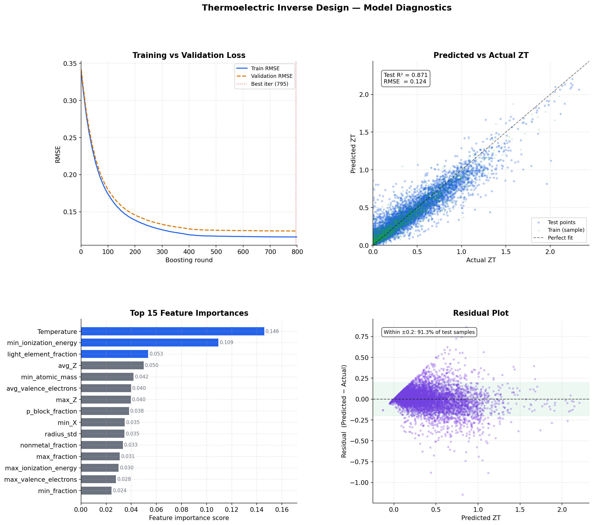
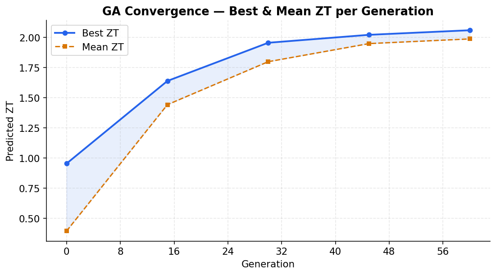
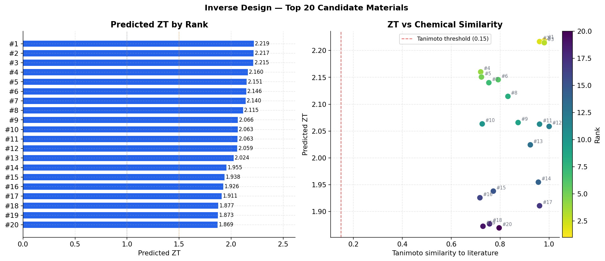

# Thermoelectric Inverse Design using Machine Learning

<p align="center">
  
</p>

<p align="center">
  
  
  
  
</p>

---

## Overview

This project focuses on the inverse design of thermoelectric materials using machine learning.

Instead of manually searching through thousands of material combinations, the model predicts promising candidate materials with desirable thermoelectric properties.

The workflow includes:

* Data curation
* Feature engineering
* Model training
* Candidate generation
* Visualization of results
* Inverse design pipeline

---

## Repository Structure

```text
thermoelectric-inverse-design-ml/
│
├── data_curation/                # Scripts for cleaning and preparing raw data
├── features_retreval/           # Scripts for extracting engineered features
├── outputs/                     # Generated graphs, predictions, and candidate files
│   ├── candidates_summary.png
│   ├── ga_convergence.png
│   ├── model_diagnostics.png
│   └── inverse_design_candidates_v2.csv
│
├── inverse_design.py            # Main inverse design pipeline
├── final_featured_ID_dataset.csv # Final curated dataset
└── README.md
```

---

## Features

* Thermoelectric material candidate prediction
* Data preprocessing and curation
* Feature engineering pipeline
* Machine learning-based inverse design
* Visualization of model performance
* Genetic algorithm convergence tracking
* Export of generated material candidates

---

## Tech Stack

* Python
* Pandas
* NumPy
* Scikit-learn
* Matplotlib
* Seaborn
* Genetic Algorithms

---

## Installation

Clone the repository:

```bash
git clone https://github.com/SudarshanRao1/thermoelectric-inverse-design-ml.git
cd thermoelectric-inverse-design-ml
```

Install dependencies:

```bash
pip install pandas numpy matplotlib seaborn scikit-learn
```

---

## How to Run

Run the main inverse design pipeline:

```bash
python inverse_design.py
```

---

## Sample Outputs

### Model Diagnostics

<p align="center">
  
</p>

### Genetic Algorithm Convergence

<p align="center">
  
</p>

### Candidate Summary

<p align="center">
  
</p>

---

## Future Improvements

* Add deep learning models
* Improve feature engineering
* Deploy as a web application
* Add explainable AI techniques
* Add support for larger material databases
* Integrate with materials science APIs

---

## Contributors

* Sudarshan Rao
* Shatrujit
* Jeevan

---

## Author

### Sudarshan Rao

AI & Data Science Student at Amrita University, Bangalore
Interested in Machine Learning, Materials Informatics, AI Research, and Filmmaking.

* GitHub: [SudarshanRao1](https://github.com/SudarshanRao1)

---

## License

This project is open-source and available under the MIT License.
